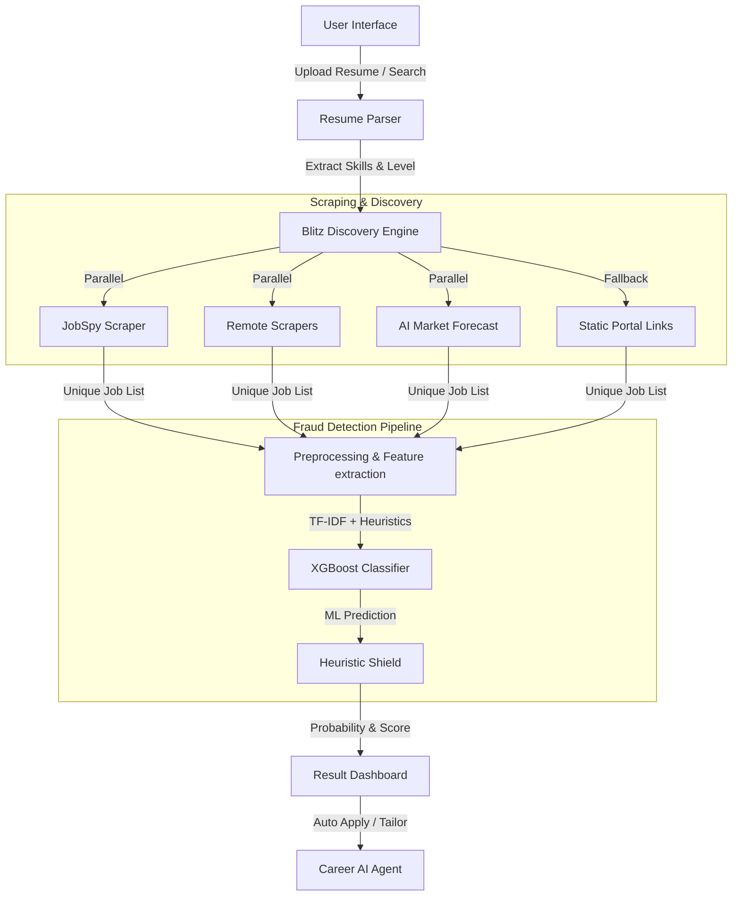

# 🚀 Fake Job Detector: System Architecture & Project Analysis

This project is a high-performance **AI-Driven Career Automation Suite**. It combines automated job discovery with a machine learning-based fraud detection system to help users find legitimate jobs while avoiding scams.

---

## 🏗️ 1. High-Level Architecture

The system follows a modular "Pipeline-as-a-Service" architecture:

---

## ⚙️ 2. Core Modules & Their Roles

### 🔍 Discovery: The "Blitz" Engine ([scraper.py](file:///e:/fake_job_detector/src/scraper.py))
*   **Parallel Execution**: Uses `ThreadPoolExecutor` to launch multiple search passes (Precise, Broad, AI) simultaneously.
*   **Resilience**: If scraping fails (due to blocking), it automatically generates AI-forecasted jobs using LLMs or provides direct search links to major portals (LinkedIn, Indeed, etc.).
*   **Deduplication**: Aggressive URL and content-based hashing to ensure unique daily listings.

### 🛡️ Detection: The ML Pipeline ([pipeline.py](file:///e:/fake_job_detector/src/pipeline.py), [model.py](file:///e:/fake_job_detector/src/model.py))
*   **Model**: An **XGBoost Classifier** specifically tuned for class imbalance (real vs. fake jobs).
*   **Features**:
    *   **Text (TF-IDF)**: Analyzes job descriptions for suspicious language patterns.
    *   **Structured Heuristics**: Detects "Red Flags" like micro-payment keywords (Paytm, GPay mentioned in description), suspicious company names, or lack of location.
*   **Heuristic Shield**: A safety layer that overrides the AI if specific high-certainty scam indicators are present.

### 📄 Profile Intelligence ([resume_parser.py](file:///e:/fake_job_detector/src/resume_parser.py))
*   Parses user resumes to extract skills, experience levels, and contact details.
*   Maps extracted skills to job search queries to improve match relevancy.

### 🌐 Application Interface ([api.py](file:///e:/fake_job_detector/src/api.py))
*   Provides a REST API (Flask) to bridge the frontend with the scraping and detection logic.

---

## 🔄 3. The Basic Pipeline Data Flow

1.  **Input**: User searches for "Python Developer" in "New Delhi".
2.  **Scrape**: The `Blitz Discovery Engine` starts scraping LinkedIn, Indeed, Glassdoor, and Remote sites.
3.  **Process**:
    *   Descriptions are cleaned.
    *   Keywords are checked against a "Scam Dictionary" (Heuristic score).
    *   TF-IDF vectorizer transforms text into numbers.
4.  **Predict**: XGBoost calculates a "Probability of Fake".
5.  **Shield**: If a job mentions "deposit ₹500 to get an interview", the `Heuristic Shield` marks it as **🚨 FAKE (100%)** regardless of what the AI says.
6.  **Output**: User sees a list of jobs with a **"Safety Score"** and **"Match Score"**.

---

## 🛠️ 4. Technology Stack
*   **Backend**: Python (Flask)
*   **Scraping**: `python-jobspy`, `requests`, `ThreadPoolExecutor`
*   **Machine Learning**: `scikit-learn`, `XGBoost`, `Pandas`, `NumPy`
*   **AI**: Groq (Llama-3 models) for resume parsing guidance and fallback job generation.
*   **Storage**: CSV-based logging (`legit_log.csv`) and JSON caching.

---

## 💡 Summary
This project isn't just a simple scanner; it's a **proactive job board filter**. It assumes that public job boards are noisy and potentially dangerous, providing a secure "sandbox" for job seekers to discover and apply to verified positions.
